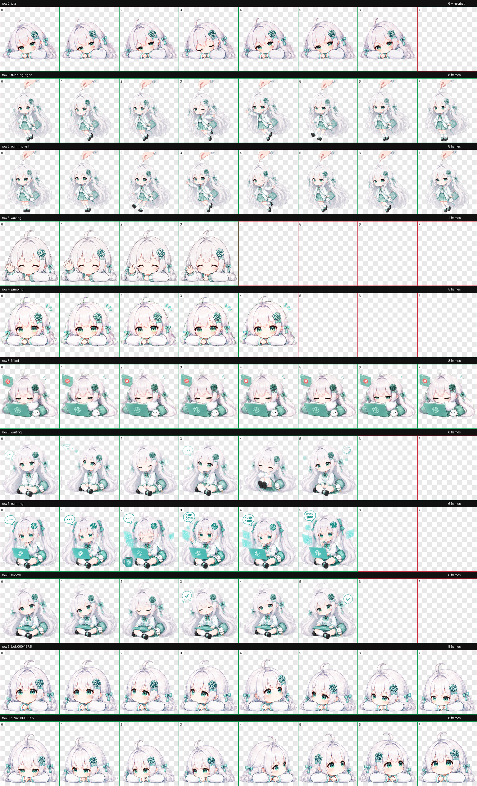
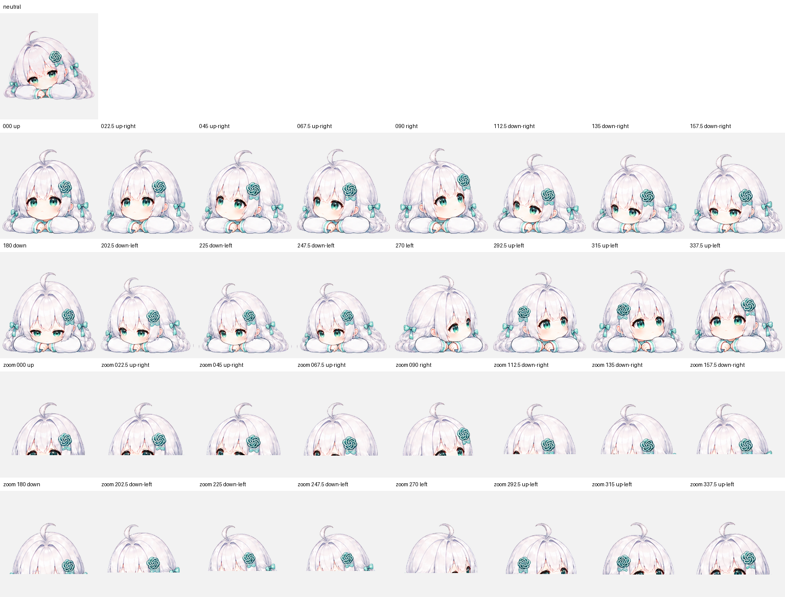

# GPT-chan:Minty / Codex Desktop Pet

[中文](README.md) | [English](README_EN.md)


<details>
<summary>View full-resolution posters</summary>


</details>

**Minty** is a custom animated desktop companion for the Codex desktop app. Her soft mint palette is inspired by the fresh, recognizable green visual identity used in GPT's early days.

## Animation Preview

| Idle | Waving |
| --- | --- |
|  |  |
| Running | Waiting |
|  |  |

<details>
<summary>View all animation frames and 16 look directions</summary>





</details>

## Installation

### Terminal

Run the following commands in Terminal on macOS:

```bash
git clone https://github.com/ren-qr/GPT-pet.git
mkdir -p ~/.codex/pets
cp -R GPT-pet/mint-candy ~/.codex/pets/mint-candy
```

Restart Codex, then select **薄荷糖 (Minty)** from the pet settings.

### Manual Installation

1. Download this repository as a ZIP file and extract it.
2. Open `~/.codex/pets/` in Finder. Create the directory if it does not exist.
3. Copy the complete `mint-candy` folder into `~/.codex/pets/`.
4. Restart Codex and select **薄荷糖 (Minty)** from the pet settings.

The installed directory should look like this:

```text
~/.codex/pets/mint-candy/
├── pet.json
└── spritesheet.webp
```

## Requirements

- A version of the Codex desktop app that supports custom pets
- Sprite format version 2
